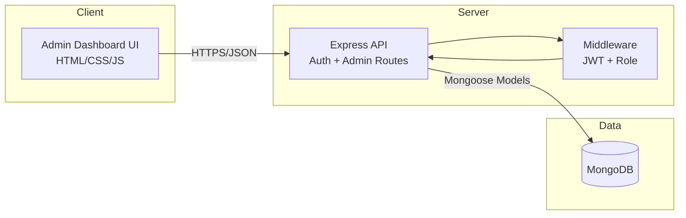
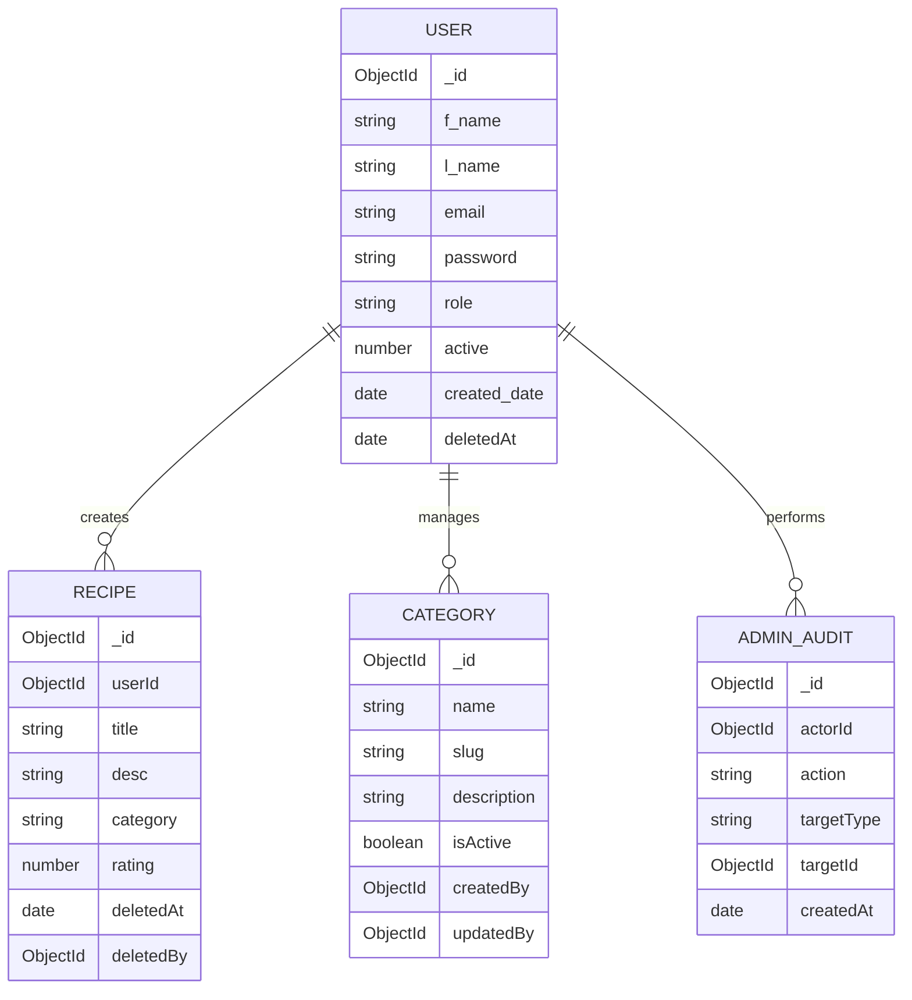
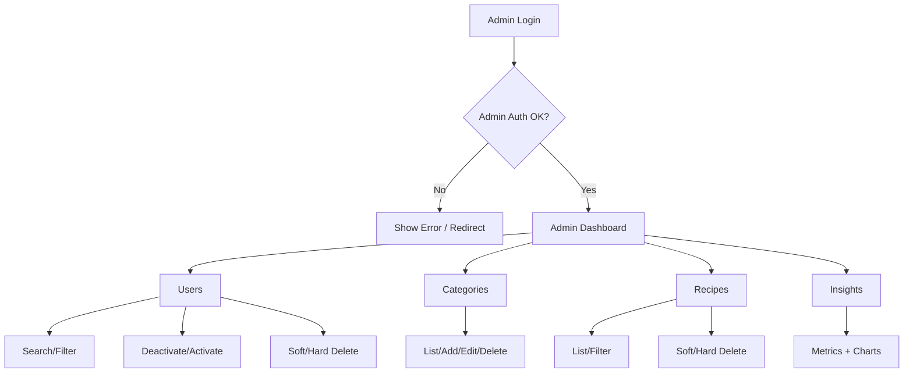
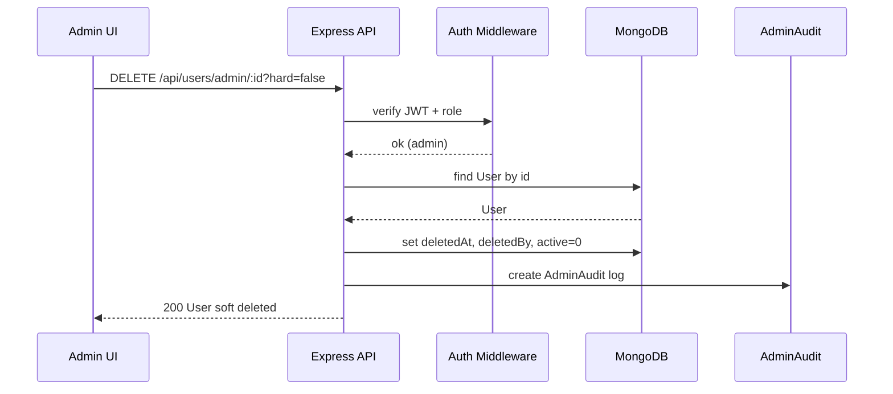
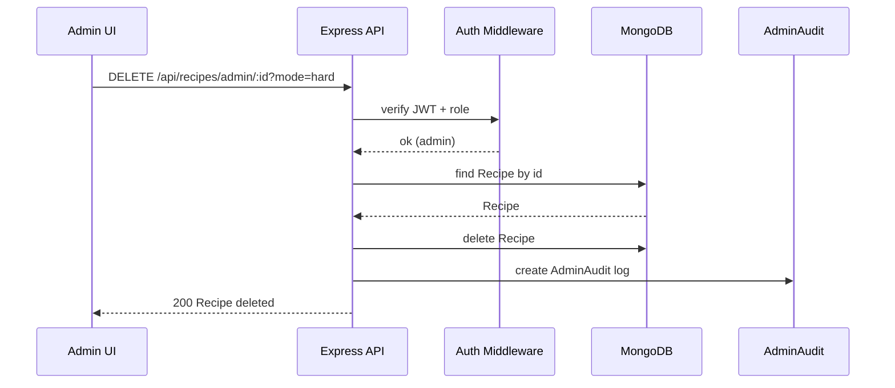

# Admin Design Diagrams

This document contains all requested design diagrams (Architecture, ERD, Admin Flow, and Sequence).

---

## 1) System Architecture (Frontend ↔ Backend ↔ DB)

---

## 2) ERD (User/Recipe/Category/AdminAudit)

---

## 3) Admin Flow (Login → Dashboard → CRUD)

---

## 4) Sequence Diagram (Admin Deletes User - Soft Delete)

---

## 5) Sequence Diagram (Admin Deletes Recipe - Hard Delete)

