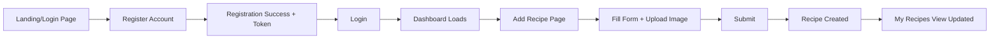
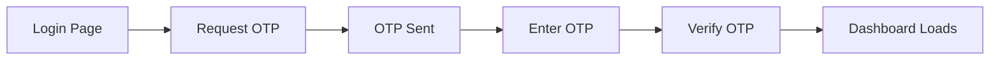
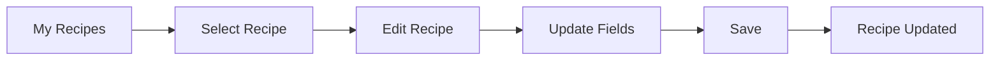
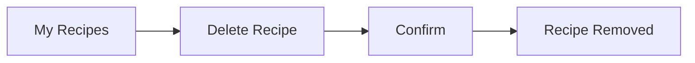
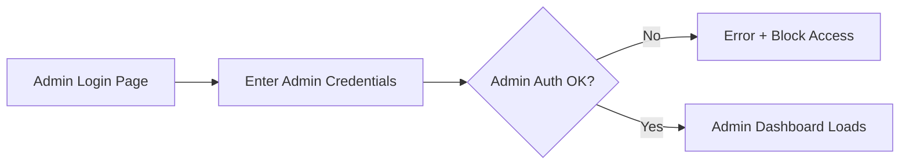
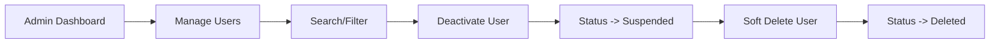
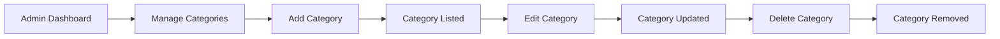
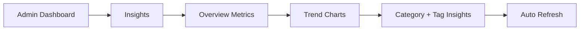

# User Journey Maps (Key Workflows)

This document provides journey maps for core user and admin workflows.

---

## 1) User Registration → Login → Create Recipe



---

## 2) User OTP Login



---

## 3) User Edit Recipe



---

## 4) User Delete Recipe (Owner)



---

## 5) Admin Login → Dashboard



---

## 6) Admin Manage Users (Deactivate + Soft Delete)



---

## 7) Admin Manage Categories (CRUD)



---

## 8) Admin Manage Recipes (List + Soft/Hard Delete)

```mermaid
flowchart LR
  A[Admin Dashboard] --> B[Manage Recipes]
  B --> C[Filter/Search]
  C --> D[Select Recipe]
  D --> E[Delete (Soft/Hard)]
  E --> F[Recipe Removed or Marked Deleted]
```

---

## 9) Admin Insights (Analytics)



